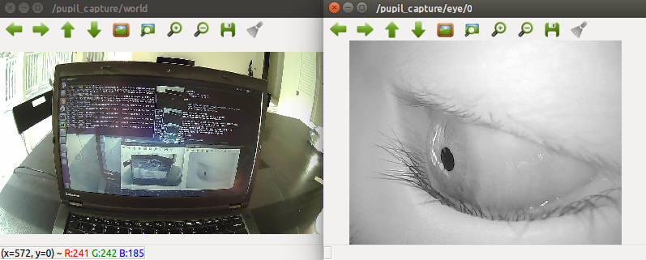

Pupil ROS Plugin
===
Author: [Long Qian](http://longqian.me/aboutme)

Date: 2016-11-19

## Overview

The programs in this repository interact with [Pupil](https://pupil-labs.com/) eye tracking device and [ROS](http://www.ros.org/) (Robot Operating System).

A pupil plugin at ```pupil_ros_plugin/plugins/pupil_ros_pub.py```,
- Init a ROS node of pupil capture
- Publish pupil tracking results, gaze mapping results, and world image to ROS environment

A ROS script at ```pupil_ros_plugin/scripts/pupil_zmq_ros_pub.py```
- Access pupil application via [ZMQ](http://zeromq.org/) subscriber
- Init a ROS node
- Publish pupil tracking results, gaze mapping results, world image and eye image to ROS environment

The two methods achieve **almost same effect**, there is no need to use both of them.

## Build Custom ROS Message
Place the folder ```pupil_ros_plugin``` to your catkin workspace, and build the ROS package.
```
>> cd Path/To/catkin_ws
>> catkin_make
>> source devel/setup.bash
```
This will build four custom ROS messages: ```pupil, pupil_positions, gaze, gaze_positions```


## Pupil Plugin Usage

### Copy Plugin to Pupil Environment
As suggested by pupil-labs, the plugins in ```pupil_ros_plugin/plugins``` can be copied to ```capture_settings/plugins```, in order to make it accessible by pupil_capture application.
```
>> mkdir -p capture_settings/plugins
>> cp pupil_ros_plugin/plugins/* capture_settings/plugins
```

### Run!
* Start ```roscore```
* Launch pupil_capture
* Load plugin ```Pupil_ROS_Bridge```, ```Frame_Publisher```, and interact with them through GUI.
* Look at the output ```rostopic echo /pupil_capture/gaze```, ```rostopic echo /pupil_capture/pupil```
* Use ```rosrun rqt_image_view rqt_image_view``` to see the world image.

## ROS Script Usage

### Run!
* Make ```pupil_zmq_ros_pub.py``` executable
```
>> chmod +x scripts/pupil_zmq_ros_pub.py
>> rosrun pupil_ros_plugin pupil_zmq_ros_pub.py
```
* Launch pupil_capture
* Load plugin ```Pupil_Remote``` and ```Frame_Publisher```
* Launch ROS package
```
>> roslaunch pupil_ros_plugin pupil_ros.launch
```

### Demo results


## Note
- An example pupil plugin is created at ```pupil_ros_plugin/plugins/example_plugin.py```, to show the API and GUI elements of [pyglui](https://github.com/pupil-labs/pyglui).

- The plugins and ROS script are tested on Linux 16.04 LTS and ROS Kinetic.

## TODO
* Support more image format; currently, only ```bgr``` is supported.
